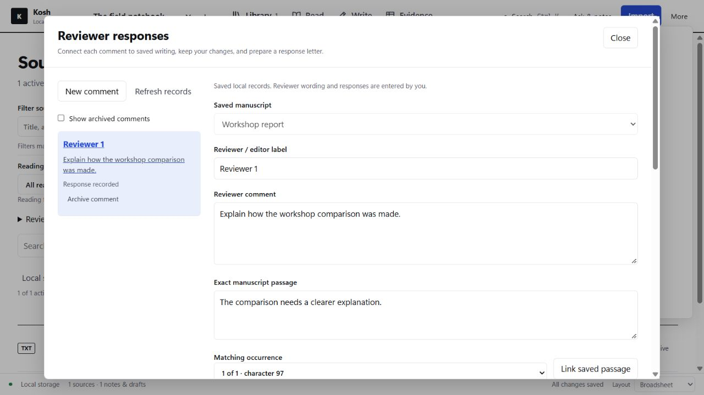
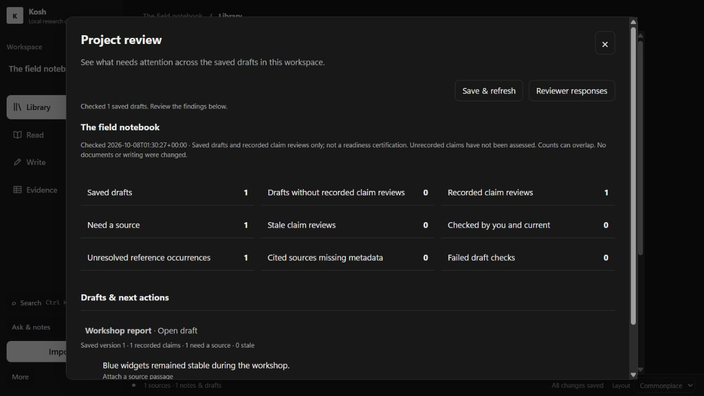
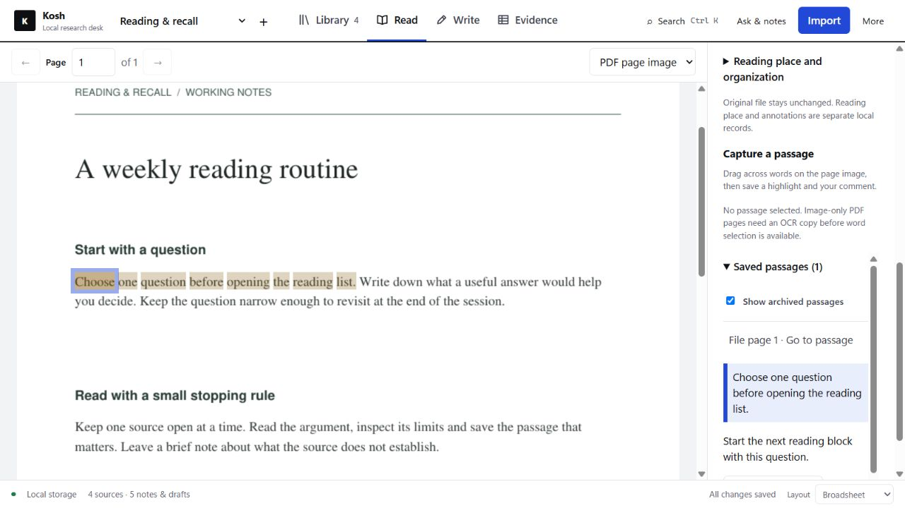
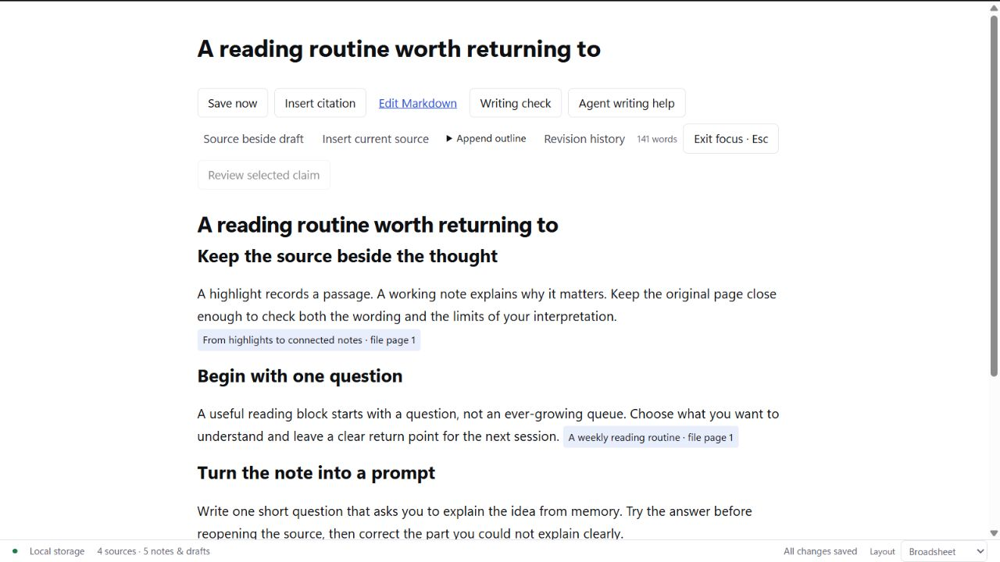
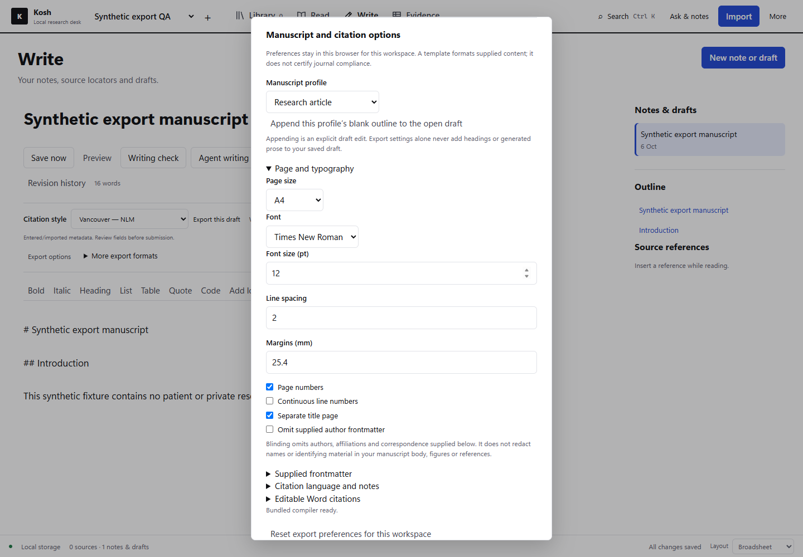
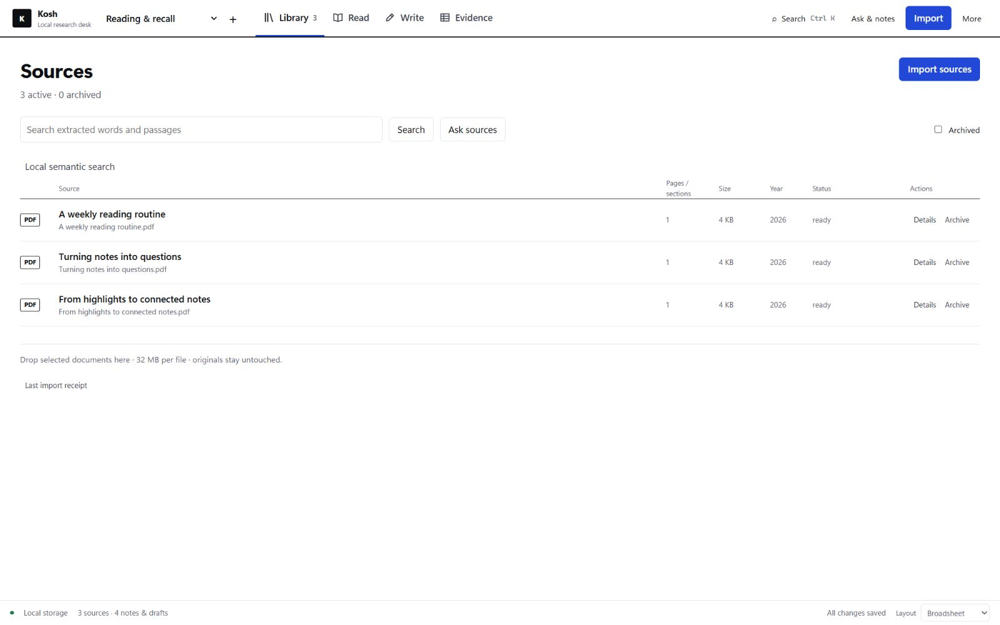

# Kosh

**From papers to a manuscript, in one local workspace.**

Kosh is a research desk for Windows. Read sources beside your draft, keep notes linked to the evidence, and take your writing into Word, PDF or LaTeX.

**[Download for Windows — 0.5.0 beta](https://github.com/needanotheremailid/kosh-desktop/releases/download/v0.5.0/Kosh-0.5.0-Setup.exe)** · [Release notes](https://github.com/needanotheremailid/kosh-desktop/releases/tag/v0.5.0) · [User guide](USER_GUIDE.md)

Already using an older Kosh installation? Follow the [copy-only upgrade guide](USER_GUIDE.md#upgrade-a-bundled-installation) to gain the new controls while retaining your old installation and backup.

64-bit Windows 11 with Microsoft Edge and .NET Framework · no administrator rights needed · **unsigned beta**: Windows may warn about an unknown publisher. [SHA-256 checksums](https://github.com/needanotheremailid/kosh-desktop/releases/download/v0.5.0/SHA256SUMS.txt).


*The image above, the gallery below and the walkthrough show an example workspace from 0.3.0. The two images in New in 0.4.0 are retained examples from the 8 October 2026 release; they do not show the 0.5.0 additions. Your library starts empty.*

## New in 0.5.0

- **Automatic local backups — Settings → Automatic local backups.** Opt in, choose an existing local folder and interval, then see last success/failure or validate a restore into a separate workspace. Backups include every workspace and saved history, run while Kosh is open, and catch up once on launch. Each workspace ZIP has a 47 MiB limit. ZIPs are unencrypted, earlier backups are retained, and unsaved browser recovery stays separate.
- **Reviewer responses — More → Reviewer responses.** Link a comment to an exact saved manuscript passage, record planned/revised wording and your response, retain changes, and export a text letter. These manual records do not change the manuscript or send a submission. The letter flags stale links and qualifies exact revised-wording matches.
- **Project review — More → Project review.** Save and check drafts and recorded claim reviews across the selected workspace. See unresolved references, metadata gaps and stale/source-needed reviews. Failed checks remain Unknown; unrecorded claims are unassessed. This is a work list, not scientific-support or submission-readiness certification.
- **In-app updates — Settings → Kosh updates.** Check the public release source, download a named installer/checksum, then separately approve installation of an unsigned package. The stopped copy workflow retains old installation/data and checks startup before shortcut changes. A matching published SHA-256 checks transfer consistency; it does not verify the publisher.

These workflows and the six additional agent controls require Kosh 0.5.0. Older installations keep their previous behavior until upgraded; the [user guide](USER_GUIDE.md#new-in-050) describes the controls and recovery boundaries.





*These 0.5.0 examples use invented, nonclinical demonstration data. Reviewer progress is a manual record; project review does not certify scientific support or submission readiness.*

## New in 0.4.0

Select words on a PDF page, save a highlight with your comment, return to its source location and create a cited note. Reading states, favorites, tags and a collection label help organise the library without changing the original PDF.



Focus writing keeps the draft and essential controls in view. Review an exact sentence beside its source passage, mark it checked yourself, and see when that record becomes stale. Draft search, a citation picker and complete Markdown section moves support the same writing workflow.



*0.4.0 demonstration captures from the 8 October 2026 release. Highlights and claim reviews are separate records; they do not edit the original paper or certify scientific support.*

<details>
<summary>Watch Kosh in 30 seconds</summary>


[Watch or download the full-resolution video](https://github.com/needanotheremailid/kosh-desktop/raw/refs/heads/main/assets/presentation/Kosh%20Walkthrough.mp4) · Silent, 30 seconds. Captioned app captures follow a source-linked note through writing, export choices and the finished PDF.

The 30-second walkthrough shows the core workflow in 0.3.0. Version 0.5.0 retains these layouts, the 0.3.1 PDF font correction and the 0.4.0 reading/writing controls, alongside the workflows described above.

</details>

## What you can do

- **Read and capture the evidence.** Import PDFs, Word documents or text, search extracted passages, and select PDF words for a saved highlight and comment. Saved passages link back to the file page or extracted section and can become cited notes. Annotations are separate local records; the original PDF stays unchanged. Create a local OCR copy when needed.
- **Write with your sources nearby.** Draft in Markdown with source context, headings, tables, figures and equations. Search titles and draft text, use focus mode, or move complete Markdown sections. Autosave, saved history and conflict recovery help you return to the work.
- **Keep citations and review claims.** Search your workspace with Insert citation, then insert a bibliography reference or an actual source locator. Record an exact selected sentence beside its quoted source passage as Needs source, Source attached or Checked by me. Changes can make the review stale; these labels record your judgement, not AI verification. Export with Vancouver/NLM, APA 7, IEEE or Chicago notes, local journal styles and 63 bundled citation locales.
- **Export for the next step.** Create Word, PDF, compiled LaTeX PDF, HTML or a source-and-figures ZIP. Configure research article, review or case-report layouts with your own frontmatter, page settings and numbering.
- **Organise the literature.** Use reading states, favorites, multiple tags and one collection label per source; combine them with source-detail/type filters and sorting. Resume the saved reading page with a next-action note. Duplicate title/DOI suggestions are read-only comparisons; they never merge or delete records automatically. Discover references through PubMed, Crossref, Europe PMC or OpenAlex and import RIS/BibTeX/CSL JSON.
- **Use AI when it helps.** Ask for source excerpts without generation, use an installed local Ollama model, or request writing proposals through an installed Codex/Claude CLI. Review the preview and result, then save an alternative or explicitly apply an eligible selection.

Choose **Broadsheet** for tabs across the top, **Stacks** for a compact icon rail, or **Commonplace** for a sidebar and centred reading/writing column. The core reading, writing, citations and exports work without AI.


<details>
<summary>See manuscript export options</summary>

Choose a manuscript layout, page settings and export format in **Exports & backup**.



</details>

<details>
<summary>Compare the three layouts</summary>

The same example library in each layout:

**Broadsheet** — tabs across the top and a wide workspace.



**Stacks** — a compact icon rail and denser workspace.


**Commonplace** — a sidebar and centred content column.


</details>

## Get started

1. **Install.** Download the Windows installer above, check the release page and checksum, then choose a new writable folder. You need 64-bit Windows 11, Microsoft Edge and .NET Framework; Python, Node, document tools, OCR data and offline TeX resources are bundled.
2. **Bring one paper.** Open Kosh, create a workspace and import a trusted file you have permission to use. Check the import receipt.
3. **Build a draft.** Open Read, capture a passage into a source-linked note, then use Write to develop it. Save and export to Word or PDF.

No AI account or separate Python/Node/TeX installation is needed for the bundled core workflow. Already using Kosh? Follow the [copy-only upgrade guide](USER_GUIDE.md#upgrade-a-bundled-installation) and retain your old installation and backup.

**Fixed in 0.3.1:** Chicago-note PDF export now includes the default Latin Modern font families needed for footnotes, including **No manuscript template**. The previous 0.3.0 font omission is corrected. See [PDF export details](USER_GUIDE.md#pdf-export-fonts-in-031).

## Local first, optional AI

Kosh has no application account, telemetry or cloud sync. Ordinary reading, saving, lexical search, citations, exports, local style import and backups run locally. Discover sends the query or identifier you submit; official CSL retrieval is a separate consented request for named files and dependencies. Update checks/downloads contact the public Kosh release source only when you choose those actions; library, notes and account information are not sent.

AI is optional. Local AI needs separately installed Ollama, a suitable model and sufficient hardware. Codex/Claude help needs your own installed CLI and authenticated provider access; provider charges and limits are separate from Kosh. Approved content may reach that provider, and its CLI can add instructions or environment metadata. Kosh downloads no model weights.

This is an **unsigned Windows beta**: Windows may warn about an unknown publisher. Check the release origin and checksum before running it. Local data and workspace ZIPs are unencrypted; keep private material out of public reports. Review OCR, bibliographic metadata and generated writing. Layout profiles do not certify journal compliance, and frontmatter blinding does not redact manuscript content. See the [full guide](USER_GUIDE.md) and [security boundaries](SECURITY.md).

In PowerShell, compare the result below with the installer's entry in [SHA256SUMS.txt](https://github.com/needanotheremailid/kosh-desktop/releases/download/v0.5.0/SHA256SUMS.txt). A match checks transfer consistency with that release; it does not verify the publisher:

```powershell
(Get-FileHash .\Kosh-0.5.0-Setup.exe -Algorithm SHA256).Hash
```

## Learn more and contribute

[User guide](USER_GUIDE.md) · [Capabilities and limits](FEATURES.md) · [Build from source](BUILDING.md) · [CLI and 63 MCP tools](AGENT_API.md) · [Contributing](CONTRIBUTING.md) · [Report a bug](https://github.com/needanotheremailid/kosh-desktop/issues/new?template=bug_report.yml) · [Private security reporting](SECURITY.md#reporting)

Kosh's research workflow was inspired by [Beeblio](https://github.com/alharkan7/beeblio-oss). The application code and assets are original; attributed citation, document and runtime components are listed in [CREDITS.md](CREDITS.md) and [THIRD_PARTY.md](THIRD_PARTY.md).

Built with assistance from **OpenAI Codex** for implementation, integration, testing, packaging and documentation, and **Anthropic Claude** for design and independent reviews. See [development credits](CREDITS.md#development-assistance).

Licensed **AGPL-3.0-only**. Your papers and notes are not relicensed. See [LICENSE](LICENSE).
