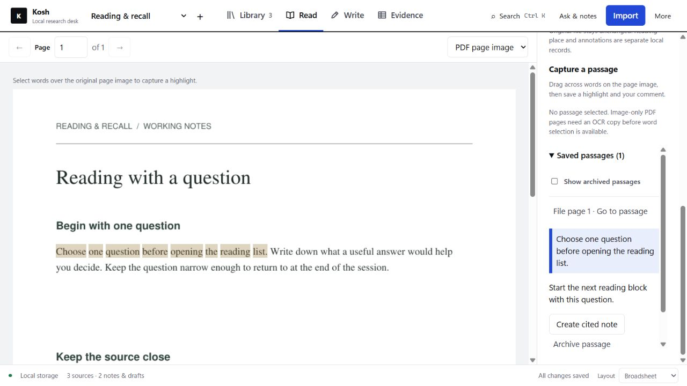
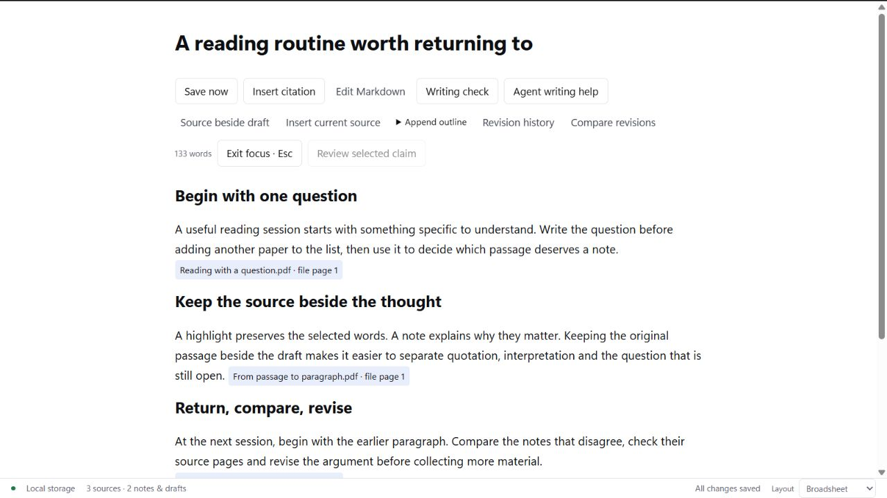
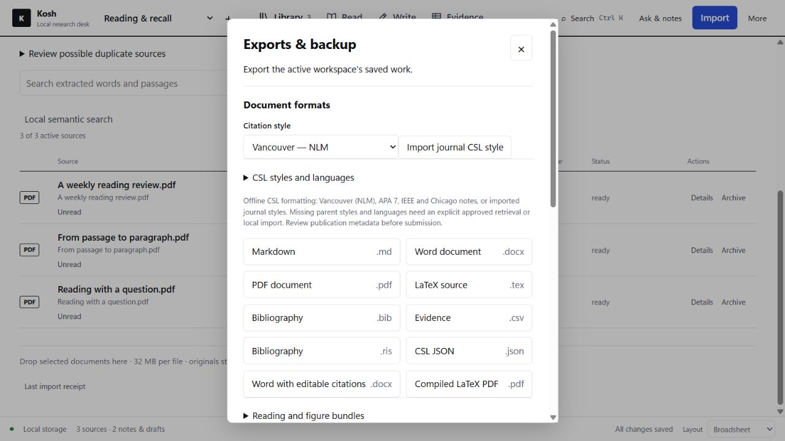
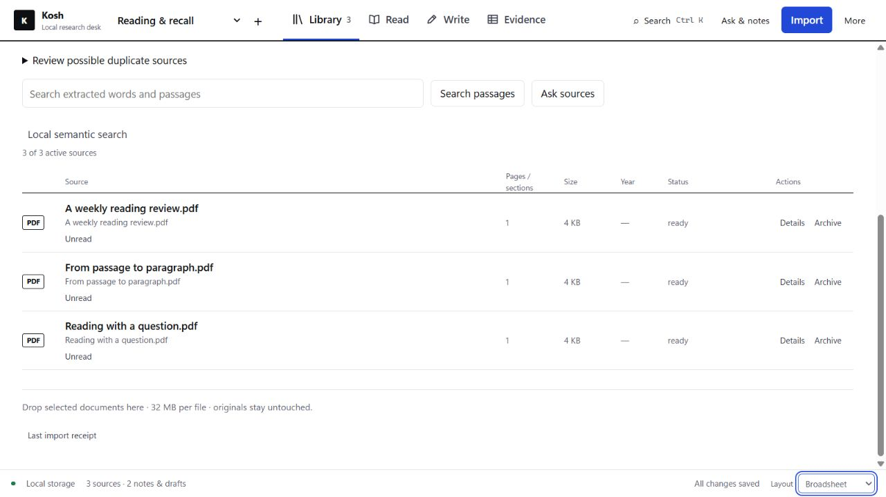
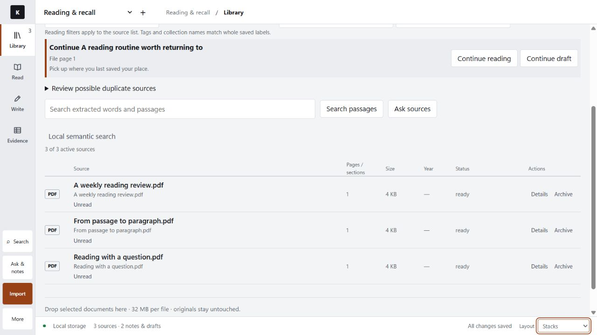
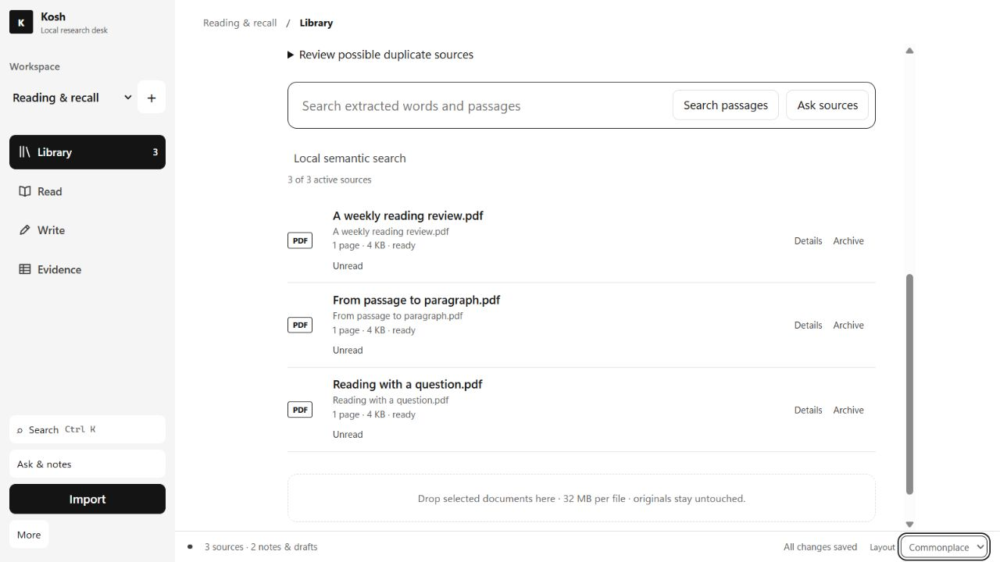

# Kosh

**From papers to a manuscript, in one local workspace.**

Kosh is a free, open-source research desk for Windows. Keep your papers, reading notes, citations and manuscript together, with a clear route back from your writing to the sources behind it.

**[Download for Windows](https://github.com/needanotheremailid/kosh-desktop/releases/download/v1.0.0-rc.3/Kosh-1.0.0-rc.3-Setup.exe)** · [Website](https://prateekguptasurgery.com/sidequests/kosh) · [User guide](USER_GUIDE.md)

Requires Windows 11 (64-bit), Microsoft Edge and .NET Framework. No administrator rights needed.



*Read the original page, highlight a passage and keep your comment beside it.*

## How it works

1. **Bring your sources together.** Create a workspace and import PDFs, Word documents, text or Markdown. Add bibliography records from BibTeX, RIS or CSL JSON. Kosh keeps managed copies of imported documents.
2. **Read and capture what matters.** Search passages, select PDF words, save highlights and comments, and return to the page where you stopped. Turn a passage into a note that keeps its source link.
3. **Write with the evidence nearby.** Develop notes into a draft, place sources beside your writing or switch to focus mode. Insert citations, figures, tables and equations. Compare saved revisions when you want to see what changed.
4. **Choose your format.** Use Vancouver/NLM, APA 7, IEEE, Chicago notes or an imported CSL style. Configure a research article, review or case-report layout.
5. **Take the manuscript with you.** Export to Word, PDF, Markdown, HTML or LaTeX, including locally compiled LaTeX PDFs. A separate Word export includes editable native citation fields. Export your references as BibTeX, RIS or CSL JSON.



*Focus on the draft while keeping its source links available.*

## Tools for the whole research workflow

| What you need to do | What Kosh provides |
| --- | --- |
| Organise a library | Workspaces, tags, reading states, favourites, collection labels, filters and sorting |
| Find a paper | Search PubMed, Crossref, Europe PMC and OpenAlex; review catalogue metadata before importing it |
| Work with scanned pages | Create a local OCR copy, then inspect the recognised text against the page |
| Find a passage | Text search and optional local semantic search with an installed embedding model |
| Check a claim | Attach an exact source passage to a selected sentence and record your own review; changed text can flag an earlier check as stale |
| Handle reviewer comments | Keep comments, planned changes and responses linked to saved draft passages, then export a response letter |
| Review a project | Check saved drafts for unresolved references, missing metadata and outstanding recorded claim reviews |
| Recover your work | Autosave, saved revisions, local backup/restore and optional automatic backups while Kosh is open |
| Share a workspace | Export a portable workspace ZIP; importing restores it as a separate workspace |
| Work with an agent | Use the CLI or 63 MCP tools, including scoped reading, writing and export operations |
| Edit a chosen folder | Review an agent's proposed changes to selected text files and approve the exact changes before they are applied |
| Learn the controls | Getting started, Help, hover explanations you can turn off, and an installation check |

Citation metadata, OCR and generated writing still need your review. Claim-review labels record your judgement; they do not certify that a source supports a conclusion. [Detailed capabilities and boundaries](FEATURES.md).

<details>
<summary>See citation and export options</summary>



Choose your citation style, manuscript settings and output format in **Exports & backup**. Native Word citation fields use Word's own bibliography styles; the standard exports use CSL.

</details>

## Choose your workspace

Kosh has three layouts, each available in light and dark themes.

- **Broadsheet:** tabs across the top and a wide workspace.
- **Stacks:** a compact navigation rail.
- **Commonplace:** a sidebar and a centred reading and writing column.

<details>
<summary>See all three layouts</summary>

**Broadsheet**



**Stacks**



**Commonplace**



</details>

## Watch the workflow


[Watch or download the 32-second video](https://github.com/needanotheremailid/kosh-desktop/raw/refs/heads/main/assets/presentation/Kosh%20Walkthrough.mp4). A silent, captioned tour of the working app and an actual PDF export.

## Local first, with optional AI

Your library is stored on your computer. Kosh has no application account, telemetry or cloud sync. Reading, writing, citations, exports and local backups work without AI.

For AI assistance, use an installed local Ollama model or your own authenticated Codex or Claude CLI. Preview the content to be sent, review the returned proposal, and choose whether to save an alternative or apply an eligible edit. Provider access, charges and limits are separate from Kosh.

Online literature searches send the query or identifier you submit. Optional style retrieval and update checks contact their named sources when you request them. Codex or Claude assistance sends approved content to that provider; its CLI may also include instructions or environment metadata. Local files and backup ZIPs are not encrypted. See the [user guide](USER_GUIDE.md) and [security information](SECURITY.md).

## Start with one paper

1. Download the installer and open Kosh. The document runtime, citation processor, OCR language data and offline TeX resources are included.
2. Follow **Getting started** to create your first workspace and import a paper.
3. Save a passage, write a short note, insert its citation and export a draft.
4. Choose a local backup location when you are ready to keep working.

Your library starts empty. Screenshots and the walkthrough use nonclinical example material. No AI account or separate Python, Node or TeX installation is needed for the core workflow.

<details>
<summary>Download details</summary>

Current package: **1.0.0-rc.3 (release candidate)**. The installer is not code-signed, so Windows may show an unknown-publisher warning.

[Release and files](https://github.com/needanotheremailid/kosh-desktop/releases/tag/v1.0.0-rc.3) · [SHA-256 checksums](https://github.com/needanotheremailid/kosh-desktop/releases/download/v1.0.0-rc.3/SHA256SUMS.txt)

Run this in PowerShell from the folder containing the installer, then compare it with the published checksum:

```powershell
(Get-FileHash .\Kosh-1.0.0-rc.3-Setup.exe -Algorithm SHA256).Hash
```

A matching checksum confirms transfer consistency with the published file; it does not verify the publisher.

</details>

## Open source and credits

Kosh is free under **AGPL-3.0-only**. Your papers and notes are not relicensed. [Licence](LICENSE).

Built with assistance from **OpenAI Codex** and **Anthropic Claude**, including Claude Opus. The research-workspace inspiration came from **Beeblio by Al Harkan**; no Beeblio application code or assets were copied. Included document, citation and runtime components retain their own credits and licences. [Full credits](CREDITS.md) · [Third-party notices](THIRD_PARTY.md).

[Build from source](BUILDING.md) · [Agent interface](AGENT_API.md) · [Contribute](CONTRIBUTING.md) · [Report a bug](https://github.com/needanotheremailid/kosh-desktop/issues/new?template=bug_report.yml) · [Media provenance](assets/presentation/README.md)
