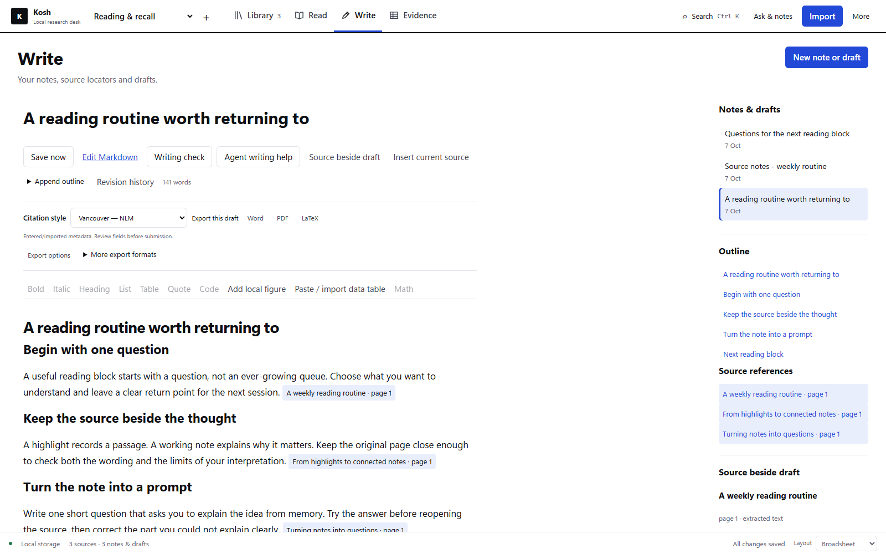
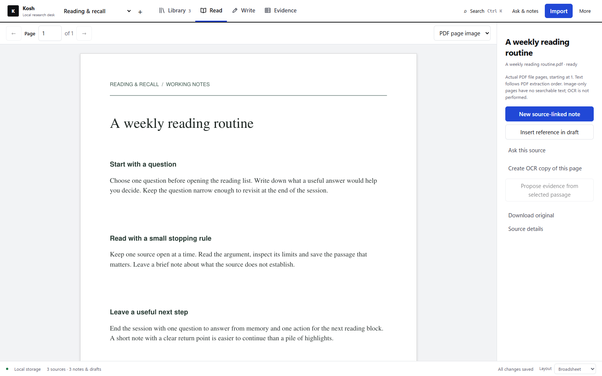
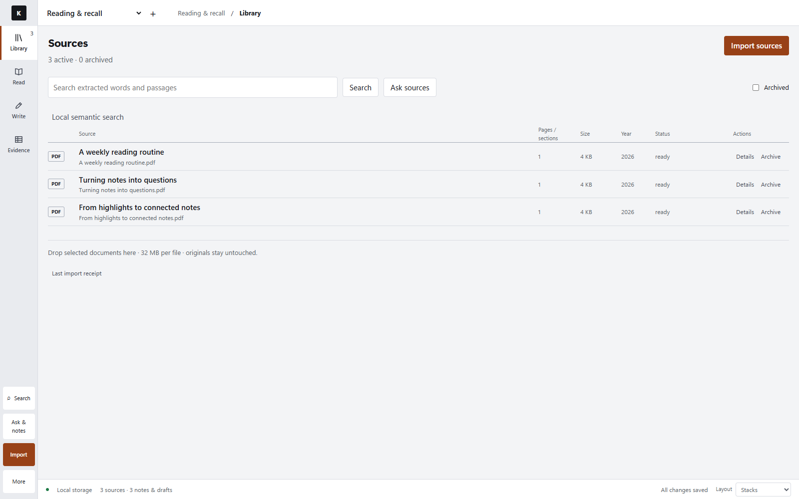
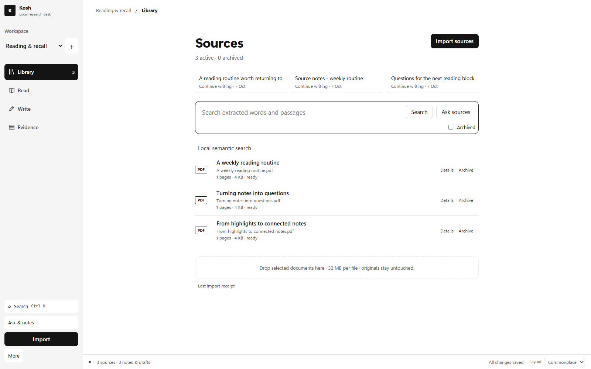

# Kosh

**From papers to a manuscript, in one local workspace.**

Kosh is a research desk for Windows. Read sources beside your draft, keep notes linked to the evidence, and take your writing into Word, PDF or LaTeX.

**[Download for Windows — 0.3.0 beta](https://github.com/needanotheremailid/kosh-desktop/releases/download/v0.3.0/Kosh-0.3.0-final-Setup.exe)** · [Release notes](https://github.com/needanotheremailid/kosh-desktop/releases/tag/v0.3.0) · [User guide](USER_GUIDE.md)

*Screenshots and the walkthrough show an example workspace. Your library starts empty.*

Watch Kosh in 24 seconds

[Watch or download the full-resolution video](https://github.com/needanotheremailid/kosh-desktop/raw/refs/heads/main/assets/presentation/Kosh%20Walkthrough.mp4) · Silent, 24 seconds.

## What you can do

- **Read and capture the evidence.** Import PDFs, Word documents or text, search extracted passages, and save notes with a link back to the source location. Compare PDF text with the page image and create a local OCR copy when needed.
- **Write with your sources nearby.** Draft in Markdown with source context, headings, tables, figures and equations. Autosave, saved history and conflict recovery help you return to the work.
- **Keep citations with the manuscript.** Use Vancouver/NLM, APA 7, IEEE or Chicago notes, import a journal CSL style, and choose from 63 bundled citation locales. Footnotes and endnotes are available for note styles; editable Word export uses separate native Word citation fields.
- **Export for the next step.** Create Word, PDF, compiled LaTeX PDF, HTML or a source-and-figures ZIP. Configure research article, review or case-report layouts with your own frontmatter, page settings and numbering.
- **Organise the literature.** Keep sources and evidence notes in project workspaces. Discover references through PubMed, Crossref, Europe PMC or OpenAlex, import RIS/BibTeX/CSL JSON, and export a workspace backup.
- **Use AI when it helps.** Ask for source excerpts without generation, use an installed local Ollama model, or request writing proposals through an installed Codex/Claude CLI. Review the preview and result, then save an alternative or explicitly apply an eligible selection.

Choose Broadsheet, Stacks or Commonplace to suit how you work. The core reading, writing, citations and exports work without AI.

Explore the other layouts

**Stacks**

**Commonplace**

## Get started

1. **Install.** Download the Windows installer above and choose a new writable folder. You need 64-bit Windows 11, Microsoft Edge and .NET Framework; Python, Node, document tools, OCR data and offline TeX resources are bundled.
2. **Bring one paper.** Open Kosh, create a workspace and import a trusted file you have permission to use. Check the import receipt.
3. **Build a draft.** Open Read, capture a passage into a source-linked note, then use Write to develop it. Save and export to Word or PDF.

No AI account or separate Python/Node/TeX installation is needed for the bundled core workflow. Already using Kosh? Follow the [copy-only upgrade guide](USER_GUIDE.md#upgrade-a-bundled-installation) and retain your old installation and backup.

## Local first, optional AI

Kosh has no application account, telemetry or cloud sync. Ordinary reading, saving, lexical search, citations, exports, local style import and backups run locally. Discover sends the query or identifier you submit; official CSL retrieval is a separate consented request for named files and dependencies.

AI is optional. Local AI needs separately installed Ollama, a suitable model and sufficient hardware. Codex/Claude help needs your own installed CLI and authenticated provider access; provider charges and limits are separate from Kosh. Approved content may reach that provider, and its CLI can add instructions or environment metadata. Kosh downloads no model weights.

This is an **unsigned Windows beta**: Windows may warn about an unknown publisher. Check the release origin and checksum before running it. Local data and workspace ZIPs are unencrypted; keep private material out of public reports. Review OCR, bibliographic metadata and generated writing. Layout profiles do not certify journal compliance, and frontmatter blinding does not redact manuscript content. See the [full guide](USER_GUIDE.md) and [security boundaries](SECURITY.md).

## Learn more and contribute

[User guide](USER_GUIDE.md) · [Capabilities and limits](FEATURES.md) · [Build from source](BUILDING.md) · [CLI and 50 MCP tools](AGENT_API.md) · [Contributing](CONTRIBUTING.md) · [Report a bug](https://github.com/needanotheremailid/kosh-desktop/issues/new?template=bug_report.yml) · [Private security reporting](SECURITY.md#reporting)

Kosh's research workflow was inspired by [Beeblio](https://github.com/alharkan7/beeblio-oss). The application code and assets are original; attributed citation, document and runtime components are listed in [CREDITS.md](CREDITS.md) and [THIRD_PARTY.md](THIRD_PARTY.md).

Licensed **AGPL-3.0-only**. Your papers and notes are not relicensed. See [LICENSE](LICENSE).
